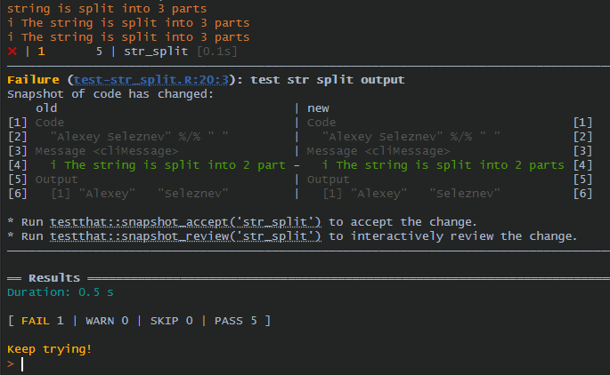
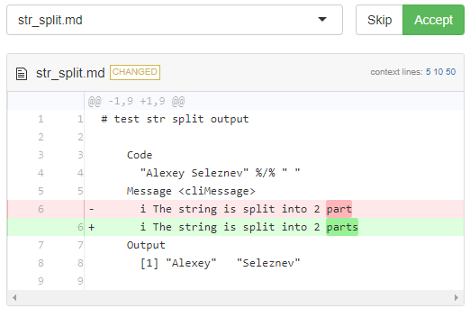

# (PART) Тестирование {-}
# Разработка юнит-тестов к функциям пакета (пакет testthat)

------

В этом видео мы разберёмся с тем, зачем покрывать код вашего пакета юнит-тестам, и как технически это реализовать.

------

::: {style="border: 2px solid #4682B4; background: #EEE8AA; padding: 15px; border-radius: 9px;"}
*Данный урок основан на главах ["Testing basics"](https://r-pkgs.org/testing-basics.html) книги ["R Packages (2e)"](https://r-pkgs.org/), под авторством Хедли Викхема и Дженни Брайан.*
:::

------

## Видео
<iframe width="560" height="315" src="https://www.youtube.com/embed/kfXCtJV-Dew?si=kdGU6BNWPRnSzWIo" title="YouTube video player" frameborder="0" allow="accelerometer; autoplay; clipboard-write; encrypted-media; gyroscope; picture-in-picture; web-share" allowfullscreen></iframe>

### Тайм коды

00:00 Вступление<Br>
00:54 Неформальный процесс тестирования<Br>
03:10 Рабочий процесс тестирования<Br>
05:44 Настройка проекта пакета для тестирования<Br>
08:34 Как создать файл тестирования для функции<Br>
10:36 Как организованы файлы тестирования<Br>
15:16 Функции-ожидания, семейство `expect_*()`<Br>
20:07 Запуск тестов<Br>
23:41 Snapshot тесты<Br>
28:41 Управление Snapshot тестами<Br>
31:02 Заключение<Br>

## Презентация
<iframe src="https://www.slideshare.net/slideshow/embed_code/key/k8Eil27RhsDXvO?hostedIn=slideshare&page=upload" width="476" height="400" frameborder="0" marginwidth="0" marginheight="0" scrolling="no"></iframe>

## Конспект

### Неформальный процесс тестирования пакета

Обычно при разработке пакета вы в любом случае тестируюете свои функции, но наверняка идёте по следующему сценарию:

1. Добавляете в пакет новую функцию
2. Загружаете весь функционал пакета с помощью `devtools::load_all()`
3. В ручном режиме тестируете новую функцию в консоли
4. В случае ошибки вносите изменения и повторяете итерацию

Этот подход конечно работает, вы действительно проверяете свою функцию на соответвие вашим ожиданиям от полученного в результате её работы рехультату. Проблема этого подхода заключается в том, что если спустя несколько месяцев вы вернётесь к разработке своего пакета, измените его код, то вам повторно прийдётся проводить все эти тесты в консоли в ручном режиме. При этом наверняка большую часьт тестов вы к тому времени уже забудете, это займёт много времени, и в целом является не эффективным подходом. 

намного эффективнее будет один раз написать все тесты, и в дальнейшем просто запускать их по мере доработки функционала пакета. Такой подход называет юнит-тестированием, или модульным тестированием, о нём в этом уроке и пойдёт речь.

### Рабочий процесс добавления тестов в пакет

Весь процесс создания и использования тестов состоит из трёх основных шагов:

1. С помощью функции `usethis::use_testthat(3)` настройте ваш пакет для тестирования:
  1. При запуске будет создан каталог `tests/testthat/`;
  2. В поле `Suggests` файла `DESCRIPTION` будет добавлен пакет `testthat`;
  3. Создастся файл `tests/testthat.R`, который отвечает за запуск ваших тестов.
2. Создание функций и тестов к ним осуществляется двумя функциями:
  1. `usethis::use_r()` – создаёт файл будущей функции в каталоге R/;
  2. `usethis::use_test()` – создаёт файл `test-function_name.R` с тестами для функции в каталоге `tests/testthat/`.
3. Запуск тестов осуществляется функцией `devtools::test()`.

### Организация тестов

Файлы с тестами, находящиеся в каталоге `tests/testthat/` должны быть организованы следующим образом:

* Файл содержит несколько связанных тестов.
* Тест объединяет несколько ожиданий для проверки выходных данных простой функции, диапазона возможностей для одного параметра более сложной функции или тесно связанныx нескольких функций. Тест создается с помощью `test_that(desc, code)`, где:
    * `desc` - краткое описание теста. Отчет о сбое теста включает это описание, поэтому вам нужно краткое изложение цели теста, например, конкретного поведения.
    * `code` – код теста, который зачастую состоит из ожиданий
* Ожидание — это атом тестирования. Он описывает ожидаемый результат вычисления: имеет ли он правильное значение и правильный класс? Выдает ли он ошибку, когда должен? Функции ожиданий имеют префикс `expect_*()`

Соответвенно изначально мы запускаем функцию `usethis::use_testthat(3)` для настройки нашего пакета.

В этом уроке мы немного доработали пакет, разработку которого рассматривали в самом первом уроке, а именно в функционал пакета был добавлен новый оператор `%/%`, который позволяет разбивать строки по разделителю.

Ниже приведён код этоо оператора:

```{r, eval=FALSE}
#' Split
#'
#' @param x string
#' @param y pattern
#'
#' @return
#' @export
"%/%" <- function(x, y) {

  if (nchar(y) >= nchar(x)) stop("Pattern for spliting longer than string")
  if (!grepl(y, x, fixed = T)) stop("Pattern is not included in the specified string")
  out <- strsplit(x, y, fixed = T)[[1]]

  cli::cli_alert_info('The string is split into {length(out)} parts')

  out

}
```

Код этой функции сохранён в файле `R/str_split.R`, с помощью команды `usethis::use_test('str_split.R')` мы создаём привязанный к функции файл тестирования, и длбавляем в него 5 тестов:

```{r, eval=FALSE}
test_that("test split value", {
  expect_equal("one two three" %/% " ", c("one", "two", "three"))
})

test_that("test split length", {
  expect_length("one two three" %/% " ", 3)
})

test_that("test class of splited obj", {
  expect_type("one two three" %/% " ", 'character')
})

test_that('test errors', {
  expect_error("one two" %/% "one two three", regexp = 'spliting longer')
  expect_error("one two" %/% "three", regexp = 'not included')
})
```

Данный файл состоит из 4 тестов, и 5 ожиданий. Первый аргумент функции `test_that` является описанием теста, т.е. какой функционал этот тест проверяет, вторым аргументом мы добавляем ожидания. В свою очередь почти все ожидания состоят из двух обязательных аргумент `object` - результат выполнения кода, который мы тестируем и `expected` - какой результат мы ожидаем получить в результате указанного в первом аргументе кода, и разного набора дополнительных аргументов, в зависимости от специфики ожидания. 

### Ожидания

Пакет `testthat` сожержит более 40 различных функций-ожиданий. Ниже перечислю основные:

* `expect_equal()`, `expect_identical()` - Возвращает ли код ожидаемое значение?
* `expect_type()`, `expect_s3_class()`, `expect_s4_class()` - Возвращает ли код объект, унаследованный от ожидаемого базового типа, класса S3 или класса S4?
* `expect_error()`, `expect_warning()`, `expect_message()`, `expect_condition()` - Выдает ли код ошибку, предупреждение, сообщение или другое условие?
* `expect_length()` - Возвращает ли код вектор указанной длины?
* `expect_lt()`, `expect_lte()`, `expect_gt()`, `expect_gte()` - Возвращает ли код число больше/меньше ожидаемого значения?
* `expect_named()` - Возвращает ли код вектор с (заданными) именами?

Функции ожидания вы вполне можете использовать интерактивно:

```{r, eval=FALSE}
library(testthat)

# ожидания
expect_equal(10, 10 + 1e-7)     # не строгое соответствие
expect_identical(10, 10 + 1e-7) # строгое соответствие

# проверка на ошибки
expect_error(1 / "a")
expect_warning(log(-1))

# тест возвращает ошибку, но не ту, которую мы проверяем
# изза опечатки в названии функции
stringr::str_duq(1:2, 1:3)
stringr::str_dup(1:2, 1:3)

expect_error(stringr::str_duq(1:2, 1:3))
expect_error(stringr::str_duq(1:2, 1:3), regexp = "recycle")
expect_error(stringr::str_dup(1:2, 1:3), regexp = "recycle")
expect_error(str_dup(1:2, 1:3), class = "vctrs_error_incompatible_size")
```

Отдельно стоит обратить внимание на второй аргумент, который мы используем в функции `expect_error()`, данный аргумент не является обязательным, но крайне рекомендуется к использования. Дело в том, что по умолчанию функция `expect_error()` всего лишь проверяет, что указанный в первом аргументе код завершается ошибкой, но не проверяет какой именно, если не использовать её дополнительные аргументы. Так, например, этот тест может ошибочно быть успешно выполнен если вы просто опечатались в названии функции, которую тестировали. 

### Запуск тестов

Т.к. наша новая функция теперь покрыта тестами мы можем их запустить командой `devtools::test()`, результаты работы будут выглядеть следующим образом:

```
══ Results ══════════════════════════════════
Duration: 0.4 s

[ FAIL 0 | WARN 0 | SKIP 0 | PASS 5 ]
```

В данном случае все наши тесты были пройдены успешно, давайте намеряно попробуем допустить какую то ошибку, и ещё раз запустим тестирование:

```
ℹ Testing firstpackage
✔ | F W S  OK | Context
⠏ |         0 | str_split                                                                                                                                         i The string is split into 3 parts
i The string is split into 3 parts
i The string is split into 3 parts
✖ | 1       4 | str_split [0.1s]                                                                                                                                  
──────────────────────────────────────────────────────────────────────────────────────────────────────────────────────────────────────────────────────────────────
Failure (test-str_split.R:6:3): test split length
"one two three"%/%" " has length 3, not length 5.
──────────────────────────────────────────────────────────────────────────────────────────────────────────────────────────────────────────────────────────────────

══ Results ══════════════════════════════════
Duration: 0.4 s

[ FAIL 1 | WARN 0 | SKIP 0 | PASS 4 ]
```

### Как читать результаты теста

В примере выше, изначально стоит обратить внимание на последнюю строку, в которой мы видим:

* FAIL 1 - количество проваленых тестов, в нашем случае 1
* WARN 0 - количество тестов с предупреждениями
* SKIP 0 - количество пропущенных тестов, например изза функции `test::skip_if_not_installed()`
* PASS 4 - количество успешно пройденых тестов

Немного выше вы найдете более подробную информацию о проваленом тесте:

* `Failure (test-str_split.R:6:3)` - в каком тестовом файле был проваленный тест, и в какой строке этого фалйа была ошибка
* `test split length` - описание того, что проваленный тест проверяет, первый аргумент функции `test_that()`
* `"one two three"%/%" "` - какой код тестировался
* `has length 3, not length 5.` - отличие полученного результата от ожидаемого

### Snapshot тесты
#### Создание snapshot теста

Этот функционал был добавлен в `testthat` версии 3.0.0. 

Snapshot тесты запоминают вывод, который был в консоли при первом его выполнении, и в будущем сравнивают текущий вывод полученный при запуске тестов, с зафиксированным при первом запуске значениям. Этот тип тестов работает только в пакетном (не интерактивном) режиме работы, т.е. их можно запустить командой `devtools::test()` или `devtools::test_file()`.

При первом запуске создаётся папка `tests/testthat/_snaps/` в которую и будут собираться снимки вывода результата работы функции в виде `.md` файлов.
При каждом следующем запуске теста, вывод работы функции будет сравниваться с созданным ранее эталоном.

Добавим snapshot тест в нашу новую функцию:

```{r, eval=FALSE}
# snapshot test -----------------------------------------------------------
test_that("test str split output", {
  expect_snapshot(
    "Alexey Seleznev" %/% " "
  )
})
```

При первом запуске этого тест создаётся файл `tests/testthat/_snaps/str_split.md`, который выглядит следующим образом:

```
# test str split output

    Code
      "Alexey Seleznev" %/% " "
    Message <cliMessage>
      i The string is split into 2 part
    Output
      [1] "Alexey"   "Seleznev"


```

Этот файл теперь являеться эталоном для сверки при всех следующих запусках теста. Он проверяет и результат, который возвращает функция, и вывод сообщений в консоль.

#### Управление snapshot тестов

Мы уже выяснили, что при первом запуске snapshot теста создаётся эталонный снимок результата, и все остальные запуски теста с ним сравниваются, но что делать если мы поняли, что при первом запуске была допущена какая то ошибка. Например в нашем случае функция после разбиения строки на подстроки выводит в консоль сообщение, о том что строка была успешно разбита на опрелённое количество частей - `i The string is split into 2 part`, но мы опечатались, и слово part написали в единственном числе, после чего нам надо изменить сообщение в функции и пересоздать эталонный снимок. 

Для этого мы вносим измение в функцию, исправив опечатку, далее запускаем тестирование, получаем сообщение об ошибке:



Я намеренно добавил этот вывод консоли скриншотом, что бы вы увидели, что консоль выделяет зелёным цветом то, что несоответвывало эталонному снимку при запуске тестирования. 

Получается функцию мы исправили, но теперь нам необходимо обновить снимок, сделать это можно с помощью следующих функций:

* Команда `testthat::snapshot_review()` запускает Shiny приложение для локального просмотра отличия в выводе функции, по сравнению с эталоном.
* Команда `testthat::snapshot_accept()` позволяет обновить эталонный снимок теста.

Т.е. далее команда `testthat::snapshot_accept()` просто обновит ваш эталонный снимок, а команда `testthat::snapshot_review()` позволит более детально изучить что пошло не так с помощью небольшого Shiny приложения:



В приложении более подробно выделено то, что не соответвует при тесте эталонному снимку. Нажав кнопку `Skip` вы оставляете прежный эталонный снимок, нажав кнопку `Accept` вы внесёте в него изменения.

## Задание

В этом уроке вместо теста будет задание:

1. Клонируйте репозиторий с пакетом `firstpackage`:
    1. В RStudio меню file -> New Project ... -> Version Control -> Git -> New Project Wizard, заполните следующие поля
        1. Repository URL: https://github.com/selesnow/firstpackage.git
        2. Project directory name: firstpackage
        3. Create project as subdirectory of: Тут укажите путь, по которому будет создан проект с пакетом firstpackage
2. После чего у вас откроется RStudio с пакетом firstpackage, далее вам необходимо:
    1. Настройте пакет для добавления тестов
    2. Создайте файл тестирования к оператору `%+%`, файл с кодом которого лежит по пути `R/str_plus.R`, добавьте следующие тесты для этого оператора:
        1. Проверьте что код `"my" %+% "little" %+% "string"` возвращал вектор длинны 1;
        2. Проверьте что код `"my" %+% "little" %+% "string"` возвращал объект класса `character`;
        3. Добавьте проверку что код `"my" %+% "little" / 7` возвращает ошибку, которая в своём сообщении содержит текст `non-numeric argument to binary operator`.
    3. Создайте файл тестирования к оператору `%/%`, файл с кодом которого лежит по пути `R/str_split.R`, добавьте следующие тесты для этого оператора:
        1. Проверьте что код `'The-little-text' %/% "-"` возвращает вектор из слов The, little, text;
        2. Проверьте что код `'The-little-text' %/% "-"` вощвращает вектор длинны 3;
    4. Запустите ваши тесты, вы должны получить описанный ниже результат:

```
ℹ Testing firstpackage
✔ | F W S  OK | Context
✔ |         3 | str_plus                                                                                                                                          
⠏ |         0 | str_split                                                                                                                                         i The string is split into 3 parts
i The string is split into 3 parts
✔ |         2 | str_split

══ Results ═══════════════════════════════════════════════════════════════════════════════════════════════════════════════════════════════════════════════════════
Duration: 0.3 s

[ FAIL 0 | WARN 0 | SKIP 0 | PASS 5 ]

Woot!
```

------

```{r, message=FALSE, echo=FALSE, warning=FALSE}
library(r2social)
r2social::r2social.scripts()
r2social::shareButton(link = "https://selesnow.github.io/r_package_course/", position = "inline", whatsapp = T, telegram = T, instagram = T)
r2social::connectButton(link = 'https://t.me/R4marketing', link.out = F, telegram = T, position = 'left')
r2social::connectButton(link = 'https://www.youtube.com/R4marketing/?sub_confirmation=1', link.out = F, youtube = T, position = 'right')
```
