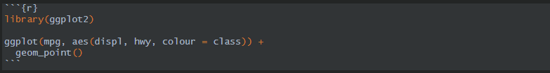

# Виньетки и прочая опциональная документация пакета

------

В этом уроке мы разберёмся с опциональной документацией уровня пакета:

* Виньетки - Статьи, подробно описывающие в свободной форме функционал пакета;
* `README` - Общее описание цели пакета и нескольких простых примеров его использования;
* `NEWS` - Файл в котором фиксируются все изменения вашего пакета.

------

::: {style="border: 2px solid #4682B4; background: #EEE8AA; padding: 15px; border-radius: 9px;"}
*Данный урок основан на следующих материалах: *

+ *Глава ["Vignettes"](https://r-pkgs.org/vignettes.html) книги ["R Packages (2e)"](https://r-pkgs.org/), под авторством Хедли Викхема и Дженни Брайан.*
+ *Глава ["Other markdown files"](https://r-pkgs.org/other-markdown.html) книги ["R Packages (2e)"](https://r-pkgs.org/), под авторством Хедли Викхема и Дженни Брайан.*
+ *Раздел ["Text Formatting in R Markdown"](https://r02pro.github.io/rmd-text-formating.html) книги [R Programming: Zero to Pro](https://r02pro.github.io/), под авторством Ян Фэн и Цзянань Чжу*
+ *Раздел ["Chunk options and package options"](https://yihui.org/knitr/options/) с [сайта](knitr) пакета knitr, автор Ихуэй Се*
:::

------

## Видео
<iframe width="560" height="315" src="https://www.youtube.com/embed/ojo8CZUPS2k?si=hzqdSa8xdl3fGo7A&enablejsapi=1" title="YouTube video player" frameborder="0" allow="accelerometer; autoplay; clipboard-write; encrypted-media; gyroscope; picture-in-picture; web-share" allowfullscreen></iframe>

### Тайм коды

00:00 Вступление<Br>
00:52 Что такое виньетки<Br>
01:45 Рабочий процесс создания виньеток<Br>
07:29 Метаданные виньетки<Br>
08:32 Разметка текста в Rmarkdown<Br>
14:24 Как добавить график в виньетку<Br>
16:19 Как добавить таблицу в виньетку<Br>
23:03 Опции чанков<Br>
28:01 Хранение исходников виньеток<Br>
28:47 Файл `README`<Br>
33:20 Файл `NEWS`<Br>
37:44 Заключение<Br>

## Презентация
<iframe src="https://www.slideshare.net/slideshow/embed_code/key/1Spz0NUMBV0H4Z?hostedIn=slideshare&page=upload" width="476" height="400" frameborder="0" marginwidth="0" marginheight="0" scrolling="no"></iframe>

## Конспект
### Виньетки

Виньетка – Свободный тип документации пакета, в котором подробно разобрано как использовать ваш пакет для рещения какой то конкретной задачи.

#### Рабочий процесс

1. Используйте функцию `usethis::use_vignette("my-vignette")`, которая сделает следующее:
    1. Создаст каталог `vignettes/`
    2. Редактирует файл `DESCRIPTION`, в поле `Suggests` добавляя пакеты `Knitr` и `Rmarkdown`
    3. Генерирует виньетку `vignettes/my-vignette.Rmd`
    4. Добавляет некоторые шаблоны в файл `.gitignore` гарантирующие, что файлы, созданные в результате предварительного просмотра ваших виньеток, останутся вне системы контроля версий.
2. Наполните вашу виньетку контентом.
3. Периодически рендите вашу виньетку с помощью `devtools::build_rmd("vignettes/my-vignette.Rmd")`, и смотрите, что получается. Другие способы рендинга будут использовать не разрабатываемую версию вашего пакета, а ту которая была уже установлена в основную библиотеку.
4. Повторяйте все шаги пока не получите нужный вам результат.

Виньетки состоят из метаданных, текста и блоков кода, далее рассмотрим эти составляющие более подробно.

#### Метаданные виньетки

Метаданные хранятся в YAML заголовках виньетки:

* `title` - это заголовок, который появляется в виньетке. При редактировании этого поля, обязательно внесите такие же изменения в `VignetteIndexEntry{}`. Они должны быть одинаковыми, но, к сожалению, это не происходит автоматически.
* `output` - формат вывода. Существует множество вариантов, но `rmarkdown::html_vignette` разработан специально для создания виньеток.
* `vignette` - блок специальных метаданных, необходимых R. Единственная запись, которую вам, возможно, придется изменить, — это файл `\VignetteIndexEntry{}`. 
* `author` – автор виньетки.
* `date` – дата обновления виньетки.

#### Особенности Rmarkdown разметки
##### Разметка текста

* `# Header1` – Заголовки
* `*italic*` - Курсив
* `**bold**` - Жирный шрифт
* \`1 + 1\` - Моноширинный шрифт
* \``\r 1 + 1`\` - Исполняемый inline код (обратный слеш перед r не нужен, я просто не нашел способа правильно экранировать эту конструкцию.)
* `[r02pro](https://r02pro.github.io/)` – Ссылка
* `^[]` - Сноска

##### Списки

Сиски бывают маркированные и нумероанные, ниже пример их создания:

Маркерованный список:

```
* Item 1
* Item 2
    + Item 2a
        - Item 2a.a
        - Item 2a.b
    + Item 2b
* Item 3
    + Item 3a
```

Нумерованный список:

```
1. uno                                           
2. dos                                            
    2.1. dos.uno  
    2.2. dos.dos  
3. tres                                            
    3.1. tres.uno  
    3.2. tres.dos
```

##### Как добавить в виньетку график

График добавляется с помощью блока кода построения графика, ниже пример с использованием `ggplot2`:



##### Как добавить в виньетку таблицы

Таблицы добавляются аналогично графику в блоках исполняемого кода. Для построения таблиц вы можете использоваьт функцию knitr::kable(), либо функционал других пакетов: `DT`, `htmlTable`, `gt`, `kableExtra`. Для построения таблиц вам необходимо передать датафрейм в функцию преобразования датафрейма в html таблицу.

Ниже небольшой пример построения таблиц:

* `kable()`

```{r}
knitr::kable(mtcars)
```

* `htmlTables`

```{r}
htmlTable::htmlTable(mtcars)
```

* `kableExtra`

```{r}
library(kableExtra)

kbl(mtcars) %>% 
kable_styling(bootstrap_options = c("striped", "hover", "condensed", "responsive"))
```

* `DT`

```{r}
DT::datatable(mtcars)
```

* `gt`

```{r}
library(gt)

gt(mtcars, rownames_to_stub = T) %>% 
  tab_header(
      title = "Демонстрация таблицы",
      subtitle = "построенной с помозью пакета gt"
    ) %>% 
  tab_source_note(
    source_note = "Встроенный набор данных mtcars"
  )

```

Как по мне наиболее функциональные таблицы получаются с использованием пакета `DT`.

#### Опции чанков

Итак, виньетки состоят из текстов и блоков кода. Блоки коды выделяются тремя апострафоми, далее идут фигурные скобки, буква `r` и далее вы можете перечислить внутри скобок опции чанков. Ниже перечислю самые частоиспользуемые из них:

* `label` – Название чанка
* `eval` – Следует ли выполнять код чанка
* `echo` - Следует ли отображать исходный код в выходном документе
* `results` – Управляет отображением результатов выполнения кода: `markup`, `asis`, `hold`, `hide`
* `warning`, `error`, `message` – Надо ли выводить в результате выполнения кода предупреждения, ошибки или сообщения

Подробное описание всех доступных опций можно найти в статье ["Chunk options and package options"](https://yihui.org/knitr/options/).

### README

`README` – Файл направленный на новых пользователей вашего пакета. Он так же будет главной страницей сайта пакета, и репозитория пакета на GitHub.

Файл `README` должен отвечать на следующие вопросы:

* Какую проблему решает ваш пакет
* Как использовать его функционал

Обычно `README` состоит из следующих пунктов:

* Параграф, описывающий общее назначение пакета.
* Пример, показывающий, как использовать пакет для решения простой проблемы.
* Инструкции по установке с кодом, который можно скопировать и вставить в R.
* Обзор, описывающий основные компоненты пакета. Для более сложных пакетов это будет указывать на виньетки для более подробной информации. Это также хорошее место, чтобы описать, как ваш пакет вписывается в экосистему целевого домена.


#### Рабочий процесс

1. Для создания README файла используйте функцию `usethis::use_readme_rmd()`.
2. Используйте `devtools::build_readme()` для рендинга и просмотра вашего README.
3. Повторяете итерации о тех пор, пока README не будет соответствовать вашим ожиданиям.

### NEWS

NEWS – Файл направленный на пользователей, которые уже используют ваш пакет. Данный файл содержит описание всех изменений в пакете.

#### Рабочий процесс

1. Наиболее удобным способом его создания является функция `usethis::use_news_md()`.
2. Перед выпуском новой версии пакета используйте функцию `usethis::use_version()`.

#### Оформление NEWS

* Каждое изменение должно быть частью маркированного списка. 
* Если у вас много изменений, возможно, вы захотите разбить их с помощью подзаголовков, `## Major changes`, `## Bug fixes` и т. д.

## Тест
<iframe id="otp_wgt_6nlbbl6u2ahy2i" src="https://onlinetestpad.com/nlbbl6u2ahy2i" frameborder="0" style="width:100%;" onload="var f = document.getElementById('otp_wgt_nlbbl6u2ahy2i'); var h = 0; var listener = function (event) { if (event.origin.indexOf('onlinetestpad') == -1) { return; }; h = parseInt(event.data); if (!isNaN(h)) f.style.height = h + 'px'; }; function addEvent(elem, evnt, func) { if (elem.addEventListener) { elem.addEventListener(evnt, func, false); } else if (elem.attachEvent) { elem.attachEvent('on' + evnt, func); } else { elem['on' + evnt] = func; } }; addEvent(window, 'message', listener);" scrolling="no">
</iframe>

------

```{r, message=FALSE, echo=FALSE, warning=FALSE}
library(r2social)
r2social::r2social.scripts()
r2social::shareButton(link = "https://selesnow.github.io/r_package_course/", position = "inline", whatsapp = T, telegram = T, instagram = T)
r2social::connectButton(link = 'https://t.me/R4marketing', link.out = F, telegram = T, position = 'left')
r2social::connectButton(link = 'https://www.youtube.com/R4marketing/?sub_confirmation=1', link.out = F, youtube = T, position = 'right')
```
