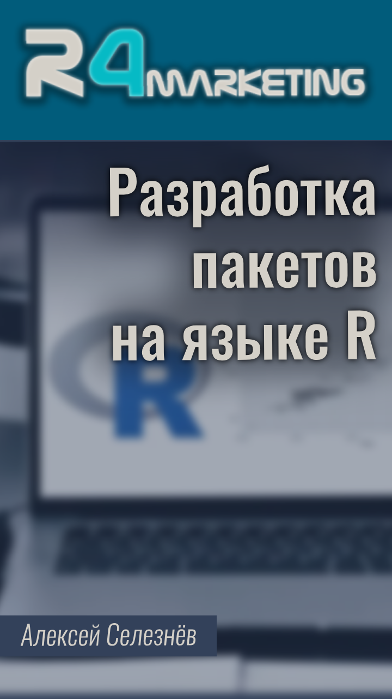

Это репозиторий курса "Разработка пакетов на языке R" под авторством Алексея Селезнёва.

На данный момент курс находится в стадии активной разработки, узнать об обновлениях курса можно на странице [новостей](https://selesnow.github.io/r_package_course/%D0%BD%D0%BE%D0%B2%D0%BE%D1%81%D1%82%D0%B8-%D0%BA%D1%83%D1%80%D1%81%D0%B0.html).

### Ссылки

* [Сайт курса](https://selesnow.github.io/r_package_course)
* [Плейлист курса на YouTube]()

### Автор курса
Алексей Селезнёв, Head of analytics dept. at [Netpeak](https://netpeak.net)
 Telegram канал автора: [R4marketing](https://t.me/R4marketing)
 Сайт с документацией к пакетам: [selesnow.github.io](https://selesnow.github.io)
 email: selesnow@gmail.com
 skype: selesnow
 facebook: [facebook.com/selesnow](https://facebook.com/selesnow)
 linkedin: [linkedin.com/in/selesnow](https://linkedin.com/in/selesnow)
 blog: [alexeyseleznev.wordpress.com](https://alexeyseleznev.wordpress.com/)