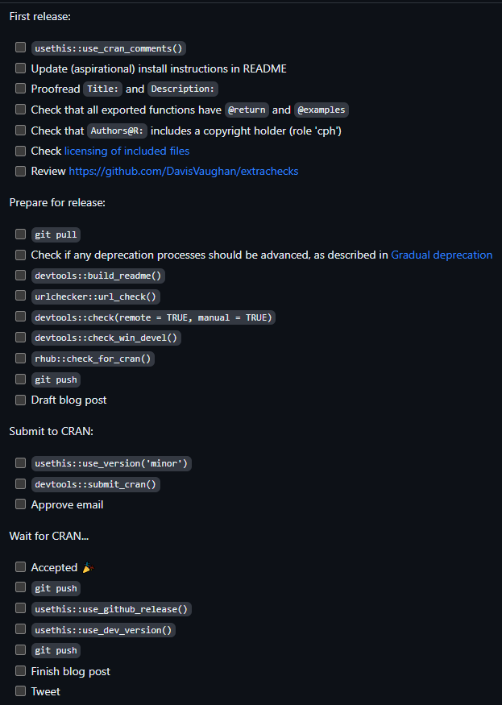
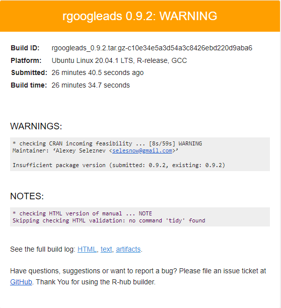
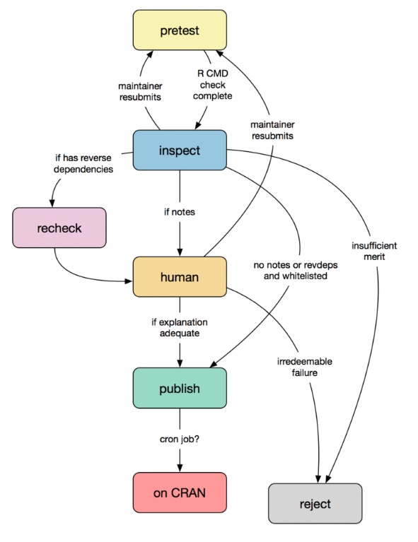
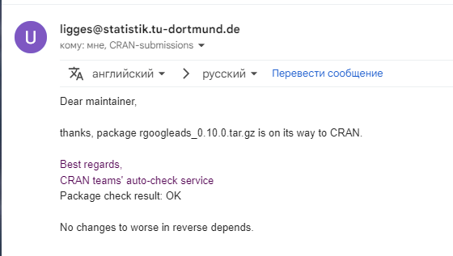

# (PART) Публикацмя {-}
# Публикация в CRAN

------

К этому моменту за 10 предыдущих уроков курса мы изучили все этапы процесса разработки собственного пакета, в этом уроке мы поговорим о том, как опубликовать ваш готовый пакет в основном репозитории хранения R пакетов - CRAN.

------

::: {style="border: 2px solid #4682B4; background: #EEE8AA; padding: 15px; border-radius: 9px;"}
*Данный урок основан на главе ["Releasing to CRAN"](https://r-pkgs.org/release.html) книги ["R Packages (2e)"](https://r-pkgs.org/), под авторством Хедли Викхема и Дженни Брайан.*
:::

------

## Видео
<iframe width="560" height="315" src="https://www.youtube.com/embed/FAwgtfGINoo?si=zol_sIU_wQ0Jahhk" title="YouTube video player" frameborder="0" allow="accelerometer; autoplay; clipboard-write; encrypted-media; gyroscope; picture-in-picture; web-share" allowfullscreen></iframe>

### Тайм коды

00:00 Вступление<Br>
01:03 Настройка непрерывной интеграции для регулярной проверки вашего пакета на разных платформах с помощью GitHub Actions<Br>
03:43 Создаём issue со списком действий по подготовке и отправке новой версии пакета на CRAN<Br>
05:54 Действия при первой отправке пакета на CRAN<Br>
07:43 Проверка полей Title и Description файла DESCRIPTION<Br>
08:25 Дополнительные проверки и исправление ошибок<Br>
16:54 Отправка пакета на CRAN<Br>
21:27 Как проходит проверка вашего пакета на стороне CRAN<Br>
22:56 Что делать в случае отказа на публикацию пакета<Br>
24:27 Получаем письмо с результатами автопроверки CRAN<Br>
24:50 Сообщение о том, что ваш пакет успешно прошел проверку и будет опубликован в CRAN<Br>
25:14 Действия, которые необходимо выполнить после публикации пакета в CRAN<Br>
28:22 Заключения<Br>

## Презентация
<iframe src="https://www.slideshare.net/slideshow/embed_code/key/FEUT2ZcuiHFadz?hostedIn=slideshare&page=upload" width="476" height="400" frameborder="0" marginwidth="0" marginheight="0" scrolling="no"></iframe>

## Конспект
### Рабочий процесс

На этом этапе весь функционал вашего пакета уже реализован, ну или как минимум его MVP версия. И вы готовы поделиться с широкой общественностью вашей разработкой опубликовав свой пакет на CRAN. Этот процесс состоит из следующих этапов:

1. Создаём на GitHub тикет со списком всех необходимых действий для публикации пакета в CRAN
2. Дополнительные проверки пакета
3. Исправление ошибок
4. Повторение первых двух итераций, до тех пор пока проверки не будут содердить как минимум ниодной ошибки (Errors) и ниодного предупреждение (Warnings), так же вы должны максимально снизить количество уведомлений (Notes)
5. Отправка пакета в CRAN
6. В случае отказа, изучение ответа от команды CRAN и внесение в пакет необходимых изменений, далее начинать всё с пункта 1
7. В случае успеха отправляем новую стабилную версию пакета на GitHub, и переключаем локальную версию пакета в режим разработки
8. Делимся нвостью о новом пакете, или о новой версии пакета в соц. сетях

Теперь давайте немного подробнее разберём все этапы.

### Безпрерывная проверка пакета

В ходе курса я неоднократно говорил о том, что в процессе разработки пакета как можно чаще запускайте проверку с помощью функции `devtools::check()`, поскольку это поможет быстро узнать об ошибке, что в свою очередь сильно облегчит её исправление. Минус запуска команды  `devtools::check()` заключается в том, что все проверки реализуются исключительно на вашей операционной системе, и с начтроенной вами средой. У пользователей вашего пакета вполне может быть другая ОС, и однозначно по другому будет настроена рабочая среда, поэтому в идеале проверки должны быть независимыми ни от операционной системы, ни тем более от её настроек и состояния рабочего окружение. Организовать безпрерывное тестирование на удалённых серверах, отдельно на Windows, Linux и MacOS можно настроив безпрерывную интеграцию с помощью сервиса GitHub Actions. 

Для этого откройте проект вашего пакета и запустите команду `usethis::use_github_action("check-standard")`. После чего в папке `.github/workflows` будет создан новый yml файл для настройки GitHub Action, который будет запускаться на GithUb при каждом вашем коммите, и запускать полный процес проверки вашего пакета на всех платформах, на которых работает R. 

Сервис GitHub Actions мы с вами уже использовали в уроке по разработке сайта пакета. Тогда мы настраивали автоматический пересбор сайта после каждого коммита.

### Создайте тикет со списком действий

Теперь создайте на GitHub специальный тикет со списком действий, необходмых при публикации пакета на CRAN, делается это с помощью команды `usethis::use_release_issue()`. 

Созданный тикет будет содержать примерно такой список:



Данный список содержит описание всех действий, которые вам необходимо выполниьт, что бы ваш пакет был опубликован в CRAN. Далее мы разберём основные действия более подробно.

### Действия при первой публикации пакета

Если вы отправляете свой пакет на CRAN впервые, то для начала сделайте следующее:

* Создайте файл CRAN_COMMENTS.md с помощью функции `usethis::use_cran_comments()`
* Добавьте в пакет файл `README`
* Добавьте в пакет файл `NEWS`
* Убедитесь, что все экспортированные функции имеют `@returns` и `@examples`
* Убедитесь в том, что в поле `Authors@R:` включен владелец авторских прав (роль «cph»)
* Проверьте корректносьт заполнения полей `Title` и `Description`:
    * В поле `title` каждое слово начинается с большой буквы и заголовок не заканчивается точкой
    * Все ссылки должны быть завёрнуты в знаки `<http://site.com>`
    * Название сервисов должно быть завёрнуто в одинарные кавычки

Пример заполнения полей Title и Description в моём пакете `rgoogleads`:

```
Title: Loading Data from 'Google Ads API'
Description: Interface for loading data from 'Google Ads API', 
    see <https://developers.google.com/google-ads/api/docs/start>. 
    Package provide function for authorization and loading reports.
```

### Дополнительные проверки перед отправкой

Далее стоит выполнить несколько дополнительных проверок. 

Функция `devtools::check(remote = TRUE, manual = TRUE)` за счёт установленных значений аргументов `remote` и `manual` добавляет в процесс проверки некоторые дополнительные этапы, которые так же включены в проверке CRAN.

Далее вам надо использовать функцию `urlchecker::url_check()` для проверки корректности всех ссылок, которые вы указывали в документации своего пакета.

Следующим запускаете проверку функцией `devtools::check_win_devel()`, которая отправит ваш пакет на проверку на сервис win-builder CRAN. Результаты этой проверки вы получите на почту в течении 15-30 минут.

Последняя рекомендуемая проверка - сервис Rhub. Для работы с ним используйте пакет `rhub`:

```{r, eval=FALSE}
rhub::validate_email('ваш имейл')
rhub::check_for_cran()
```

Сначала вам необходимо валидировать ваш email, команда `rhub::validate_email('ваш имейл')` сгенерирует на вашу почту письмо с токеном, скопируйте его, и вставьте в консоль в ответ на запрос `Token: `.

И командой `rhub::check_for_cran()` отправляете ваш пакет на проверку. Также, в течении примерно 15 минут вы получите на почту ряд писем, каждое письмо сожержит информацию о проверке на одной конкретной платформе, и выглядеть они будут примерно так:



На уведомление `checking CRAN incoming feasibility ... [8s/59s] WARNING Maintainer: ‘Alexey Seleznev <selesnow@gmail.com>’` можете не обращать внимание, это уведомление исключительно для команды CRAN, и не говорит о том. что в вашем пакете есть какие либо проблемы.

Все вышеперечисленные проверки обязательно должны пройти успешно, т.е. результат не должен содержать ниодной ошибки и предупреждения (кроме того, о котором я написал выше), и желательно не сожержать уведомлений (NOTES).

### Процесс отправки пакета

Если ваш пакет успещно прошел все перечисленные в предыдущем пункте проверки - вы готовы к его публикации на CRAN. Теперь пришло время изменить версию пакета командой `usethis::use_version()`. Далее отправить пакет на CRAN одной из соедующих команд:

* `devtools::submit_cran()` - упрощённая отправка
* `devtools::release()` - повторно проводит вас по всему этапу подготовки пакета, задавая вопросы

Каждая из этих функций в итоге отправляет пакет на CRAN, а уже сам CRAN отправляет вам на email письмо для валидации адреса. Откройте вашу почту и перейдите по ссылке указанной в письме. После чего вы будете перенаправлены на CRAN, где должны поставить несколько галочек, и подтвердить что выполнили все необходимые этапы подготовки вашего пакета перед его публикацией. 

Теперь ваш пакет находится в стадии проверки со стороны CRAN.

### Проверка пакета на стороне CRAN

Схематически весь дальнейший процесс проверки вашего пакета выглядит так:



1. Сначала пакет попадает на pretest, результаты этих автопроверок вы получите на почту
2. Если в ходе автопроверки в вашем пакете был хоть один ERROR или WARNING, то пакет автоматически отклоняется
3. Если автопроверка была пройдена без ERRORS и WARNINGS:
    1. Если ваш пакет публикуется первый раз то он попадает на ручную проверку сотрудником CRAN
    2. Если ваш пакет публикуется повторно, и в ходе автопроверок был хоть один NOTES, то он попадает на ручную проверку сотрудником CRAN
    3. Если ваш пакет публикуется повторно, и в ходе автопроверок не было ниоднонго NOTES, то пакет автоматически уходит на публикацию в CRAN
4. Пакет, который попал на ручную прверку далее проверяется сотрудником CRAN, и уже исходя из его субъективного мнения может быть отправлен на доработку или далее публикован в CRAN.

Важно терпимо относится к полученному вами ответу и комментарию от сотрудника CRAN, даже если ваш пакет был отклонён. Внимательно почитай по какой именно причине его отклонили, внесите требуемые правки, переключите версию пакета, и начинайте всё с первого пункта. Опубликовать свой первый пакет в CRAN достаточно сложно, наберитесь терпения, и наверняка всё в итоге получится.

### Ваш пакет опубликован на CRAN

Наконец вы получили следующее письмо от команды CRAN



и ваш пакет публикуется на CRAN. 

Сделайте ещё несколько шагов:

1. С помощью команды `usethis::use_github_release()` отправьте стабильную версию вашего пакета на GitHub.
2. Командой `usethis::use_dev_version()` переключите локальную версию вашего пакета в режим разработки.
3. Поделитесь с сообществом новостью о том, что ваш новый пакет опубликован на CRAN, или что его новая версия там опубликована.

Вот мы с вами и прошлись весь путь разработки собственного пакета, подробно разабрав все его этапы. 

## Тест
<iframe id="otp_wgt_37rsxeipxrivm" src="https://onlinetestpad.com/37rsxeipxrivm" frameborder="0" style="width:100%;" onload="var f = document.getElementById('otp_wgt_37rsxeipxrivm'); var h = 0; var listener = function (event) { if (event.origin.indexOf('onlinetestpad') == -1) { return; }; h = parseInt(event.data); if (!isNaN(h)) f.style.height = h + 'px'; }; function addEvent(elem, evnt, func) { if (elem.addEventListener) { elem.addEventListener(evnt, func, false); } else if (elem.attachEvent) { elem.attachEvent('on' + evnt, func); } else { elem['on' + evnt] = func; } }; addEvent(window, 'message', listener);" scrolling="no">
</iframe>

------

```{r, message=FALSE, echo=FALSE, warning=FALSE}
library(r2social)
r2social::r2social.scripts()
r2social::shareButton(link = "https://selesnow.github.io/r_package_course/", position = "inline", whatsapp = T, telegram = T, instagram = T)
r2social::connectButton(link = 'https://t.me/R4marketing', link.out = F, telegram = T, position = 'left')
r2social::connectButton(link = 'https://www.youtube.com/R4marketing/?sub_confirmation=1', link.out = F, youtube = T, position = 'right')
```
