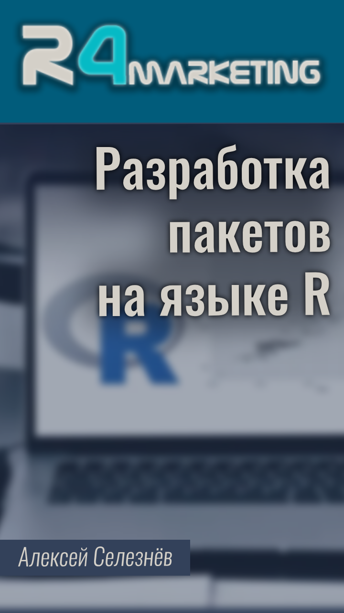

--- 
title: "Курс 'Разработка пакетов на языке R'"
author: "Алексей Селезнёв"
date: "`r Sys.Date()`"
site: bookdown::bookdown_site
documentclass: book
bibliography: [book.bib, packages.bib]
url: https://selesnow.github.io/r_package_course
cover-image: img/cover.jpg
description: |
  Бесплатный видео курс по разработке собственных пакетов на языке R.
biblio-style: apalike
csl: chicago-fullnote-bibliography.csl
---

# Введение {-}

------

## О курсе {-}
<a href="https://selesnow.github.io"></a>Мое знакомство с языком R началось в 2016 году, когда я решил использовать его для сбора данных через API из различных рекламных платформ. Для некоторых из них уже существовали готовые решения в виде пакетов, но для менее известных площадок пришлось создавать собственные инструменты. Тогда я столкнулся с ограниченностью существующих ресурсов и решил самостоятельно разобраться в создании R-пакетов.

На тот момент подробных руководств было мало, и я приходил к пониманию процесса методом проб и ошибок. Используя базовые функциональности R, такие как функция package.skeleton(), я разрабатывал пакеты. Этот опыт был насыщен избытком ненужной ручной работы, например я руками редактировал все `.Rmd` файлы, из которых далее генерируются HTML файлы с документацией к функциям.

Сегодня в главном хранилище R-пакетов - CRAN, опубликовано [15](https://cran.r-project.org/web/checks/check_results_selesnow_at_gmail.com.html) моих собственных пакетов. За годы разработки я столкнулся с различными трудностями, но мой опыт привел меня к замечательной книге Хедли Викхема и Дженни Брайан ["R Packages (2e)"](https://r-pkgs.org/), которая послужила основой для этого курса.

Тем не мене, курс не является полным повторением книги, я упустил из его программы наиболее теоритеские главы, но добавил некоторые темы, не упомянутые в ней. В Результате данный курс сконцентрировал в себе передовые методики разработки пакетов описанные Викхемом и Брайан, дополненные моим семилетним практическим опытом.

Разработка R-пакетов - отличный способ улучшить навыки программирования на R и глубже погрузиться в изучение языка. Этот курс шаг за шагом проведет вас через процесс создания собственных пакетов. Первый урок позволит вам написать свой первый пакет. Более того, вы сможете внести свой вклад в развитие языка, делясь своими наработками в виде R-пакетов.

Добро пожаловать на курс "Разработка пакетов на языке R"! Удачи в его прохождении!

## Для кого этот курс {-}
Данный курс я не могу рекомендовать новичкам. Заниматься разработкой пакетов лучше имея за плечами определённый опыт написания кода на R. Поэтому не стоит начинать изучения R с данного курса, ниже я дам небольшую подборку подготовительных курсов, изучив которые можно попробовать себя в разработке пакетов.

## По поводу поддержки обучающихся на данном курса {-}
**Важно!** Поддержки учащихся на этом курсе со стороны автора нет. Я не занимаюсь частными консультациями, тем более не консультирую студентов бесплатных курсов. Поэтому не имеет никакого смысла писать мне в личку или на почту просьбы помочь с прохождением этого, или любого другого моего бесплатного курса. Если вы столкнулись с трудностями при прохождении курса и вам нужна помощь, то все вопросы можно адресовать в следующие telegram чаты:

* [R (язык программирования)](https://t.me/rlang_ru)
* [Горячая линия R](https://t.me/hotlineR_EU)

Отдельного чата со студентами непосредственно этого курса не существует, но при желании вы самостоятельно можете его организовать, и я с радостью добавлю на него ссылку.

К тому же, если у вас есть вопросы по одной из лекций курса, вы можете задавать его под видео лекции на YouTube, это приветствуется, и на такие комментарии я с радостью отвечу.

Буду рад любой конструктивной критике, и предложениям по улучшению курса "разработка пакетов на языке R", направлять их можно мне на почту selesnow@gmail.com. Если вы хотите выразить благодарность мне за курс, то в конце раздела описано как это можно сделать.

## Рекомендации по прохождению курса {-}
Данный курс состоит из 14 видеолекций общей продолжительностью более 6 часов. В конце каждого урока вы найдете небольшой тест или задание для закрепления материала лекции. Прохождение тестов не является обязательным, тем не менее я крайне советую пройти тест после просмотра лекции. Тесты помогут акцентировать ваше внимание на наиболее важных моментах урока и проверить, насколько вы усвоили материал.

Также каждый урок содержит конспект лекции. Для достижения максимального эффекта от обучения и дальнейшего использования полученных знаний, придерживайтесь следующего алгоритма:

1. Посмотрите полное видео лекции.
2. Пройдите тест или выполните задание к уроку.
3. В дальнейшем, при разработке пакета, ищите нужную информацию в конспекте лекции или найдите в тайм-кодах время нужной части лекции и пересмотрите его.
Таким образом, вы пройдете весь материал курса и сможете быстро в дальнейшем пересмотреть отдельно нужную вам его часть при разработке ваших пакетов.

## Об авторе {-}
Меня зовут Алексей Селезнёв, с 2008 года я являюсь практикующим аналитиком. На данный момент основной моей деятельностью является развитие отдела аналитики в агентстве интернет-маркетинга [Netpeak](https://https://netpeak.group/).
<a href="https://selesnow.github.io"></a>

Мною были разработаны такие R пакеты как: `rgoogleads`, `rfacebookstat`, `timeperiodsR` и некоторые другие. На данный момент написанные мной пакеты только с CRAN были установленны более 200 000 раз.

Также я являюсь автором некоторых других курсов по R (ссылки на них приведу ниже), лектором академии [Web Promo Experts](https://webpromoexperts.net/) и соавтором курса ["Веб-аналитика Pro"](https://webpromoexperts.net/courses/analytics-pro/).

Веду свой авторский [Telegram](https://t.me/R4marketing) и [YouTube](https://www.youtube.com/R4marketing/?sub_confirmation=1) канал R4marketing. Буду рад видеть вас в рядах подписчиков.

Периодически публикую статью на различных интернет медиа, зачастую это [Хабр](https://habr.com/ru/users/selesnow/) и [Netpeak Journal](https://netpeak.net/ru/blog/user/publication/826/).

Неоднократно выступал на профильных конференциях по аналитике и интернет маркетингу, среди которых Матемаркетинг, GoAnalytics, Analyze, eCommerce, 8P и прочие.

## Другие курсы автора {-}
Как я уже писал выше, помимо курса "Разработка пакетов на языке R" у меня есть ряд других бесплатных курсов:

1. [Язык R для интернет маркетинга](https://r-for-marketing.netpeak.net/auth/sign/in), для начинающих, требуется бесплатная регистрация
2. [Язык R для пользователей Excel](https://selesnow.github.io/r4excel_users/), для начинающих
3. [Введение в dplyr 1.0.0](https://selesnow.github.io/dplyr_1_0_0_course), средней уровень сложности
4. [Циклы и функционалы в языке R](https://selesnow.github.io/iterations_in_r/), средней уровень сложности
5. [Разработка telegram ботов на языке R](https://selesnow.github.io/build_telegram_bot_using_r/), высокий уровень сложности

## Каналы автора {-}
Если вы интересуетесь языком R, применяете его в работе, или планируете изучать, то думаю вам будут интересны мои каналы, о которых я писал выше. Буду рад видеть вас среди подписчиков:

* [Telegram канал R4marketing](https://t.me/R4marketing)
* [Youtube канал R4marketing](https://www.youtube.com/R4marketing/?sub_confirmation=1)

## Программа курса {-}

1. [Обзор рабочего процесса разработки пакета]
2. [Настройка системы и интеграция с GitHub]
3. [Рекомендации по организации R кода]
4. [Добавление данных в пакет]
5. [DESCRIPTION - Метаданные пакета]
6. [NAMESPACE - Зависимости пакета]
7. [Разработка юнит-тестов к функциям пакета (пакет testthat)]
8. [Написание документации к функциям пакета]
9. [Виньетки и прочая опциональная документация пакета]
10. [Разработка сайта пакета (пакет pkgdown)]
11. [Публикация в CRAN]
12. [Разработка пакета обёртки над API (пакет httr2)]
13. [Разработка пакета обёртки для Google API (пакет gargle)]
14. [Как создать коллекцию пакетов]

<Br>
_Дата обновления курса: `r format(Sys.Date(), "%d.%m.%Y")`_

## Благодарности автору {-}
Курс, и все сопутствующие материалы предоставляются бесплатно, но если у вас есть желание отблагодарить автора за этот видео курс вы можете перечислить любую произвольную сумму на [этой странице](https://secure.wayforpay.com/payment/r4excel_users).

Либо с помощью кнопки:
<center>
<script type="text/javascript" id="widget-wfp-script" src="https://secure.wayforpay.com/server/pay-widget.js?ref=button"></script> <script type="text/javascript">function runWfpWdgt(url){var wayforpay=new Wayforpay();wayforpay.invoice(url);}</script> <button type="button" onclick="runWfpWdgt('https://secure.wayforpay.com/button/b9c8a14345975');" style="display:inline-block!important;background:#2B3160 url('https://s3.eu-central-1.amazonaws.com/w4p-merch/button/bg2x2.png') no-repeat center right;background-size:cover;width: 256px!important;height:54px!important;border:none!important;border-radius:14px!important;padding:18px!important;box-shadow:3px 2px 8px rgba(71,66,66,0.22)!important;text-align:left!important;box-sizing:border-box!important;" onmouseover="this.style.opacity='0.8';" onmouseout="this.style.opacity='1';"><span style="font-family:Verdana,Arial,sans-serif!important;font-weight:bold!important;font-size:14px!important;color:#ffffff!important;line-height:18px!important;vertical-align:middle!important;">Оплатить</span></button>
</center>

Так же вы можете поделиться ссылкой на курс у себя в соц сетях, за что я тоже буду вам благдарен!

------

```{r, message=FALSE, echo=FALSE, warning=FALSE}
library(r2social)
r2social::r2social.scripts()
r2social::shareButton(link = "https://selesnow.github.io/r_package_course/", position = "inline", whatsapp = T, telegram = T, instagram = T)
r2social::connectButton(link = 'https://t.me/R4marketing', link.out = F, telegram = T, position = 'left')
r2social::connectButton(link = 'https://www.youtube.com/R4marketing/?sub_confirmation=1', link.out = F, youtube = T, position = 'right', display.inline = FALSE)
```
